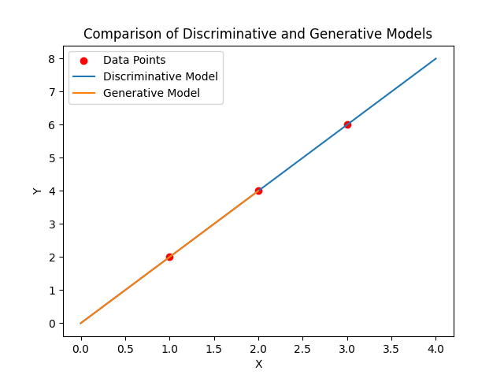

## Chapter 2

## Supervised learning

A supervised learning model defines a mapping from one or more inputs to one or more outputs. The model is just a mathematical equation; when the inputs are passed through this equation, it computes the output, and this is termed **inference**. The model equation also contains parameters. 

### 2.1 Supervised learning overview

In supervised learning, our goal is to build a model, denoted as $f_{\phi}(\cdot)$, that takes an input $\mathbf x$ and outputs a prediction $\mathbf y$. 

$$
\mathbf y = f_\phi(\mathbf x)
$$

where the $\phi$ represents the model's parameters.

### Notes

> **Loss functions vs. cost functions**: In much of machine learning books, the terms of loss function and cost function are used interchangeably.  However, more properly, a loss function is the individual term associated with a data point, and the cost function is the overall quantity that is minimized. *A cost function can contain additional terms that are not associated with individual data points*.

> **Generative vs. discriminative models**: The models $\mathbf y=f_\phi(\mathbf x)$ are **discriminative models**. These make an output prediction $\mathbf y$ from real-world measurements $\mathbf x$. Another approach is to build a **generative model** $\mathbf x = g_\phi(\mathbf y)$, in which the real-world measurements $\mathbf x$ are computed as a function of the output $\mathbf y$.
>
> - The generative approach has the disadvantage that it doesn't directly predict $\mathbf y$. To perform inference, we must invert the generative equation as $\mathbf y = g^{-1}_\phi(\mathbf x)$, and this may be difficult. 
> - The generative models have the advantage that **we can build in prior knowledge about how the data were created**. 
>
> In fact, discriminative models dominate modern machine learning; the advantage gained from exploiting prior knowledge in generative models is usually trumped by learning very flexible discriminative models with large amounts of training data.

### Problem

#### Problem 2.1

> To walk "downhill" on the loss function $\mathcal L$, we measure its gradient with respect to the parameters $\phi_0$ and $\phi_1$. Calculate expressions for  the slopes $\partial \mathcal L / \partial \phi_0$ and  $\partial \mathcal L / \partial \phi_1$
> 

$$
\begin{aligned}
\mathcal L &= \sum_{i=1}^I (f_\phi(x_i) - y_i)^2\\
&= \sum_{i=1}^I(\phi_0 +\phi_1x_i - y_i)^2
\end{aligned}
$$

$$
\begin{aligned}
\frac{\partial\mathcal L}{\partial \phi_0} &= \sum_{i=1}^I 2(\phi_0 + \phi_1x_i - y_i)\\
\frac{\partial\mathcal L}{\partial \phi_1} &= \sum_{i=1}^I2(\phi_0+\phi_1x_i - y_i)x_i
\end{aligned}
$$

#### Problem 2.2

> Show that we can find the minimum of the loss function in closed form by setting the expression for the derivatives from problem 2.1 to zero and solving for $\phi_0$ and $\phi_1$. 

We have calculated the partial derivatives with respect to the two parameters. By setting these derivatives equal to zero, we can locate the critical points at which the loss function may achieve its minimum. For convex optimization problems such as ours, there critical points correspond to the *global minimum*.

$$
\begin{aligned}
\frac{\partial\mathcal L}{\partial \phi_0} &= \sum_{i=1}^N 2(\phi_0 + \phi_1x_i - y_i) = 0\\
\frac{\partial\mathcal L}{\partial \phi_1} &= \sum_{i=1}^N2(\phi_0+\phi_1x_i - y_i)x_i = 0
\end{aligned}
$$

By solving above two equations, we can explicitly determine the values of $\phi_0$ and $\phi_1$ that minimize the loss function.

$$
\begin{aligned}
\phi_0 &= \frac{1}{N}\sum_{i=1}^N (y_i -  \phi_1 x_i)\\
&=\mathbf {\bar y} - \phi_1 \mathbf {\bar x}
\end{aligned}
$$

combined Eq.(5), we can derive the following expression for $\phi_1$

$$
\begin{aligned}
 \sum_{i=1}^N \phi_1x_i^2 &= \sum_{i=1}^N (y_ix_i - \phi_0 x_i)\\
\phi_1 &= \frac{\sum_{i=1}^N (x_iy_i - \mathbf {\bar y}x_i)}{\sum_{i=1}^N (x_i^2 - \mathbf {\bar x}x_i)}
\end{aligned}
$$

#### Problem 2.3 

[code](./code.ipynb)

> Consider reformulating linear regression as a generative model, so we have $x=g_\phi(y)$. *What is the new loss function?* Find an expression for the inverse function $y = g^{-1}_{\phi}(x)$ that we would use to perform **inference**. Will this model make the same predictions as the **discriminative** version for a given training dataset $\{x_i, y_i\}$ ? One way to establish this is to write code that fits a line to three data points both methods and see if the result is the same.

The goal of generative models is to maximize the likelihood of the data, that is, to find the parameters $\phi$ that maximize the probability of observed data. The linear regression for generation are formulated as follows.

$$
x = g(y)=\phi_0 + \phi_1 y + \epsilon, \epsilon \in \mathcal N(0, \sigma^2)
$$

Given the parameter $\phi =\{\phi_0, \phi_1\}$, the likelihood of observed data $(x, y)$ as follows.

$$
\begin{aligned}
L (\phi, \sigma| x, y) &= \frac{1}{\sqrt{2\pi\sigma^2}}\exp\left(-\frac{(x -g(y))^2}{2\sigma^2}\right)\\
L (\phi, \sigma| x, y) &= \frac{1}{\sqrt{2\pi\sigma^2}}\exp\left(-\frac{(x -(\phi_0 + \phi_1 y + \epsilon))^2}{2\sigma^2}\right)
\end{aligned}
$$

by taking the log-likelihood, the loss function is negative log-likelihood.

$$
\begin{aligned}
\mathcal J(\phi, \sigma|x,y) &= -\log L(\phi, \sigma|x,y)\\
&=\frac{1}{2\sigma^2}(x - (\phi_0 + \phi_1y))^2 + \log\sqrt{2\pi\sigma^2}\\
&\approx (x - (\phi_0 + \phi_1y))^2
\end{aligned}
$$

> The loss function of generative linear model is similar with discriminative linear models. But there are some inherent differences.
>
> - Generative models: The goal is to model the distribution of the input data $x$ given a category y, which is $P(x|y)$, or more generally, the **joint distribution** $P(x,y)$. During the learning process, the class label y is considered a conditional variable, and the model tries to understand input data x is generated under each category.
> - Discriminative models: The goal is to directly model the **conditional probability distribution** of the output y given the input x, that is $P(y|x)$, The loss function typically measures the difference between prediction and ground-truth. In there models, x is the given features, and y is target variable that model aims to predict. 

Now, we can inverse the generative function $g_\phi(\cdot)$ to inference. 

$$
y = g^{-1}_\phi(x) = \frac{x-\phi_0}{\phi_1}
$$

